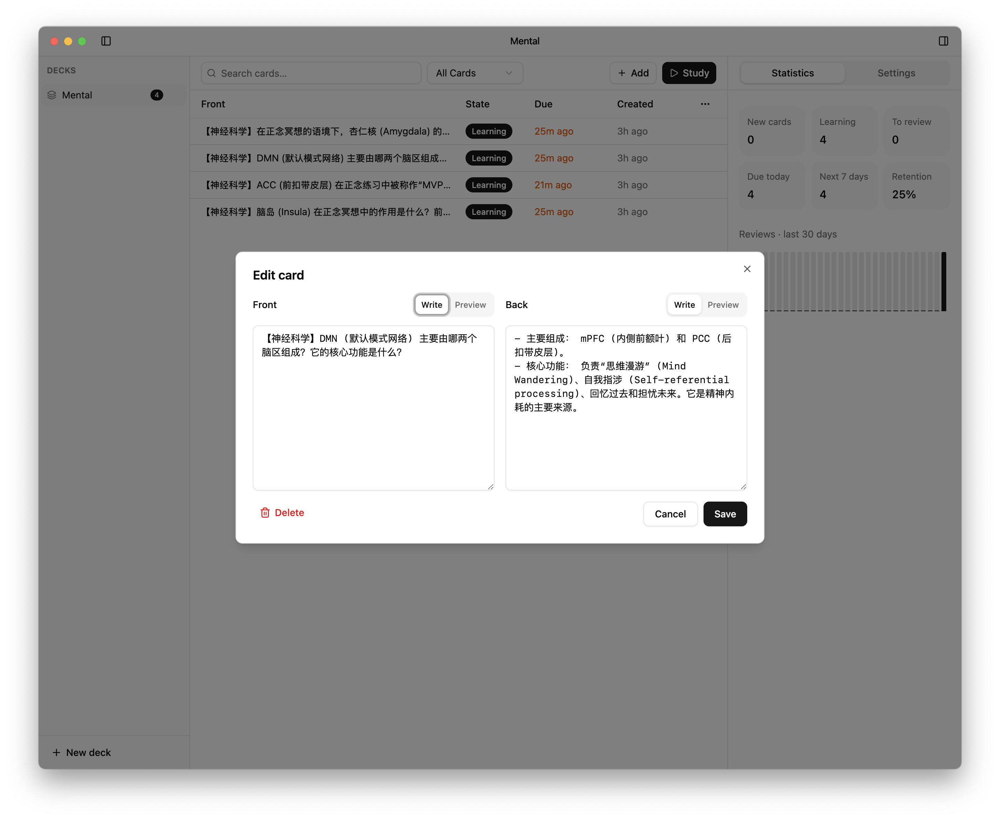
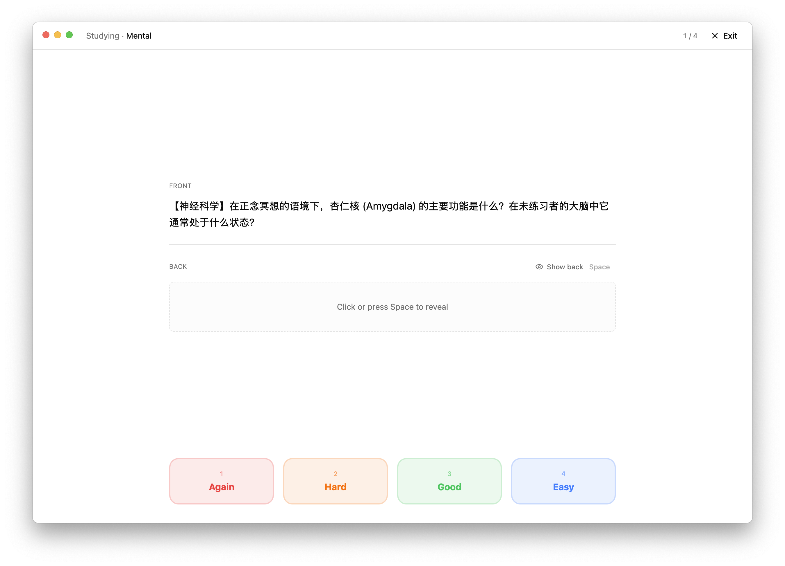

# Tudu — A Smooth Spaced Repetition App

Tudu is a modern, minimalist spaced repetition application for macOS. Built with a focus on simplicity and efficiency, it helps you learn and retain knowledge using the FSRS (Free Spaced Repetition Scheduler) algorithm.




## 💻 Requirements

- **macOS 12.0 (Monterey)** or later
- **Apple Silicon** (M1/M2/M3/M4 chips) recommended

## ✨ Features

- **Efficient Learning**: Powered by the **FSRS algorithm** for optimal review scheduling.
- **Deck Management**: Organize your knowledge into decks and sub-decks.
- **Rich Card Editor**: Create and edit cards with support for markdown and media.
- **In-depth Statistics**: Visualize your progress with detailed charts and review history.
- **Local First**: All data is stored locally in a SQLite database for privacy and speed.
- **Native Experience**: A refined Three-Pane interface that feels at home on macOS.

## 🚀 Installation

You can download the latest version (`.dmg` or `.zip`) from the [Releases](https://github.com/limboy/tudu/releases/latest) page.

## 🛠 Development

### Prerequisites

- [Node.js](https://nodejs.org/) (Latest LTS recommended)
- [npm](https://www.npmjs.com/)

### Setup

1. Clone the repository:
   ```bash
   git clone https://github.com/limboy/tudu.git
   cd tudu
   ```

2. Install dependencies:
   ```bash
   npm install
   ```

### Running Locally

Start the development server:

```bash
npm run dev
```

### Building for Production

To pack the application for macOS (`.dmg`):

```bash
npm run build
```

The output will be available in the `dist` directory.

> [!TIP]
> **Notarization**: If you want to use an Apple Developer account for notarization, set the following environment variables in your `.env` file (see `.env.example`):
> - `APPLE_ID`: Your Apple ID email.
> - `APPLE_APP_SPECIFIC_PASSWORD`: An app-specific password.
> - `APPLE_TEAM_ID`: Your Apple Team ID.

## 🛠 Tech Stack

- **Core**: [Electron](https://www.electronjs.org/)
- **Frontend**: [React](https://reactjs.org/) + [Vite](https://vitejs.dev/)
- **Algorithm**: [ts-fsrs](https://github.com/open-spaced-repetition/ts-fsrs)
- **Database**: [better-sqlite3](https://github.com/WiseLibs/better-sqlite3)
- **Styling**: [Tailwind CSS](https://tailwindcss.com/) + [Radix UI](https://www.radix-ui.com/)
- **Icons**: [Lucide React](https://lucide.dev/)

## 📄 License

This project is licensed under the **MIT License**. 

---

Made with ❤️ for lifelong learners.
